World Generation

# What is World Generation
World Generation is the act of programatically placing and removing tiles from the world. World Generation is done in two places, during world creation and in-game. The vast majority of this guide will focus on world generation during world creation, but in-game considerations will also be detailed.

World generation is a fairly complex topic, and a good understanding of many topics is required to work effectively. It is recommended to familiarize yourself when the following sections before jumping stright into the code. In addition, using an IDE with edit and continue support like Visual Studio is highly recommended.

# Table of Contents
* Terminology
* Prerequisite Knowledge
* Debugging World Generation
* Code Setup
* Determining a suitable index
* Determining a starting location
* Common Patterns
* In-Game/Multiplayer considerations
* Stamp Tiles
* Procedural Syntax
* Useful Methods

# Terminology
## Pass, Step, and Task
When a world is generated, the game runs each pass in order. In this guide, the term step will refer to individual sections of code that make up a pass. World Generation is composed of Passes, and Passes are composed of Steps. For example, a Pass that makes a biome could be composed of 2 steps, the first step digging holes, and the 2nd step placing trees. The term Task could be equivalent to Pass, but we will avoid that term in this guide since Task has another meaning that we will need later on in the guide. 


# Prerequisite Knowledge
## Tile Coordinates
The very top left of the world is located at `0, 0` in tile coordinates, and the bottom right at `Main.maxTilesX, Main.maxTilesY`. These cordinates directly map into `Main.tile[,]`. See [Coordinates](https://github.com/tModLoader/tModLoader/wiki/Coordinates) for more info. By convention, we use `x` and `y` or `i` and `j` in code for tile coordinates. We need mutliple pairs of variables because many times we are working with coordinates derived from other coordinates. 

## Main.tile[,]
`Main.tile[,]` is an 2D array containing all the tiles in the world. You can directly access the `Tile` object at a specific `x` and `y` coordinate during worldgen by writing `Tile tile = Main.tile[x, y];`. If you are checking tiles in-game, you must use `Tile tile = Framing.GetTileSafely(x, y);` because the Tile object might be `null`. Be mindful that negative numbers or coordinates outside the bounds of the world will lead to errors. To avoid this, use the [`WorldGen.InWorld`](#InWorldLinkHere) method.

## Tile class
The `Tile` class contains all the data at the tile it represents. The most important fields are `type` and `wall`, which represent the TileType and WallType present at the location. See [Tile Class Documentation](https://github.com/tModLoader/tModLoader/wiki/Tile-Class-Documentation) for more details on the various fields and methods of the `Tile` class.

## Framed vs FrameImportant Tiles
It is vital to remember that tiles in Terraria come in two basic varieties. There are normal terrain tiles like dirt, ores, and stone, and there are tiles that are not terrain tiles, like trees, anvils, paintings, and so on. Terrain tiles are known as "Framed" tiles because the game adjusts their look depending on nearby tiles. For example, placing a gemspark block next to an existing gemspark block tile changes the look of the original gemspark block and makes them look like a single deposit of ore.
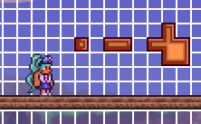    
The other tiles, known as FrameImportant or multitiles, have a defined look that doesn't change. The important thing to know is that replacing Framed tiles with other Framed tiles is easy, simply set `Tile.type` to the new Tile type. Attempting to manually place FrameImportant tiles or replace them is much harder. 

## Framing
Framing is the process where the game adjusts the `Tile.frameX` and `Tile.frameY` values of tiles to adjust their look to fit their context. In world generation code, you do not need to worry about framing because the game frames all tiles automatically when loading the world. If you are changing Tiles in-game, you do need to tell the game to frame nearby tiles. [ExampleSolution.cs](https://github.com/tModLoader/tModLoader/blob/master/ExampleMod/Projectiles/ExampleSolution.cs#L68) shows a situation where tile framing and syncing is needed.
Here is an example of unframed tiles. In this example, all the gemspark blocks have `tile.frameX` and `tile.frameY` values of 0. If you ever see tiles like this in-game, then you have buggy code.    
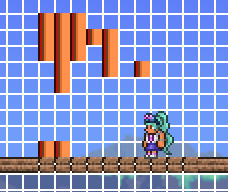    
This is the result after tile framing.    
    
Here we can see how tiles use `frameX` and `frameY` to determine the portion of their spritesheet to draw. For example, the tile outlined in red has frameX of 36 and frameY or 0, meaning that the 16x16 section of the sprite starting at the pixel coordinates 36, 0 is drawn for this Tile.     
    

# Debugging World Generation
Testing world generation code can be very time consuming. First you have to make code changes, build and reload the mod, wait for the world to finish generating, then explore the newly generated world to see the end result. This process can be streamlined to make writing and testing world generation code much more productive. 

To be more productive, it is beneficial to have a setup where code testing can be done quickly. The short videos and pictures shown in this guide were all accomplished with a setup that allowed editing source code in-game, manually triggering world generation steps in-game, and undoing world changes. This setup is not required, but can make writing and testing world generation code require less guesswork and be much more productive.

It is a good idea to test individual steps of a pass before blindly testing a complete pass. Start small and slowly expand the scope of your testing. For example, to test a pass that adds an ore, first test a single `WorldGen.TileRunner` execution using the process below to get the parameters right. Once that is working, test the completed pass independently to verify that the frequency of the ore is correct. Finally, if needed, test the pass in a real world generation scenario to make sure it works completely. 

## The Setup

1. Download and enable the following mods: HEROs Mod and Modders Toolkit 
2. Add the following code to your project, make sure to fix the namespace. You can replace the `WorldGen.TileRunner` method later once you get confortable with this process:
```csharp=
using Terraria;
using Terraria.ModLoader;
using Microsoft.Xna.Framework.Input;
using Terraria.ID;
using Microsoft.Xna.Framework;
using Terraria.World.Generation;
using Terraria.GameContent.Generation;

namespace WorldGenTutorial
{
	class WorldGenTutorialWorld : ModWorld
	{
		public static bool JustPressed(Keys key) {
			return Main.keyState.IsKeyDown(key) && !Main.oldKeyState.IsKeyDown(key);
		}

		public override void PostUpdate() {
			if (JustPressed(Keys.D1))
				TestMethod((int)Main.MouseWorld.X / 16, (int)Main.MouseWorld.Y / 16);
		}

		private void TestMethod(int x, int y) {
			Dust.QuickBox(new Vector2(x, y) * 16, new Vector2(x + 1, y + 1) * 16, 2, Color.YellowGreen, null);

			// Code to test placed here:
			WorldGen.TileRunner(x - 1, y, WorldGen.genRand.Next(3, 8), WorldGen.genRand.Next(2, 8), TileID.CobaltBrick);
		}
	}
}
```
3. Make sure tModLoader is closed, then start debugging your mod. After the mod builds, tModLoader will launch. When tModLoader launches, open a World you don't care about. Place Visual Studio on one side of the screen and tModLoader in windowed mode on the other:
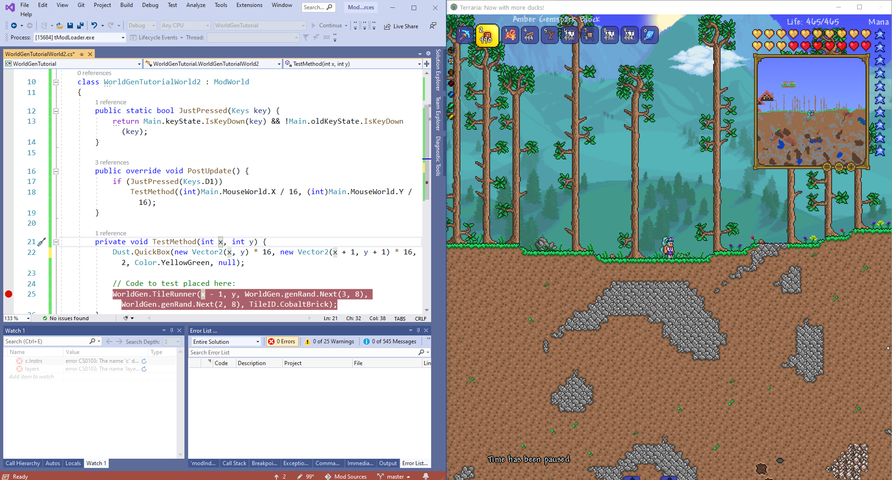    
4. In HEROsMod, click on the buttons to Disable Enemy Spawns, set Light Hack to 100%, turn on God Mode, and Reveal Map. These settings will let you focus.
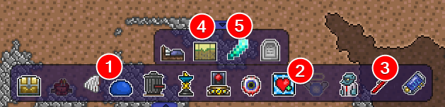    
5. With HEROsMod enabled, right clicking on the full screen map will teleport the player. Teleport to an area typical of the area you eventually wish to place your world generation code.
6. If the code you are testing is pretty destructive, use the Take World Snapshot button in the Miscellaneous Tool menu in Modders Toolkit to preserve a copy of the world. (The button is near the bottom right of the screen)
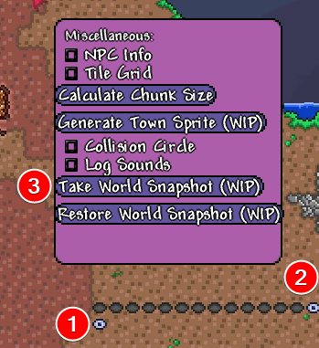    
7. Set a breakpoint on the line of code you wish to experiment on. Clicking in the "gutter" of the line you wish to experiment on sets a breakpoint.:
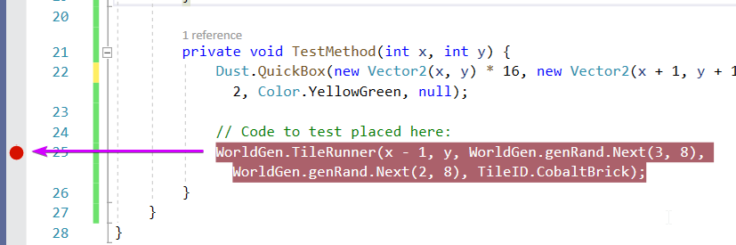    
8. Repeat the following 
	1. Hover over the tile you wish to attempt to test your code, then press the `1` key on your keyboard. 
	2. Visual Studio will immediately take focus, as it has hit the breakpoint we set. This will be indicated by the yellow arrow in the gutter:
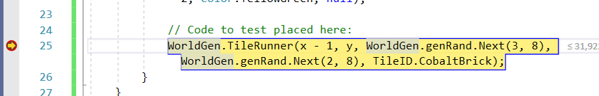    
	3. Now you can edit the code. If this is your first time, simply press `F5` to continue. Otherwise, change variables and other logic at or below the yellow arrow. Once you have completed your changes press `F5` to continue.
    4. Back in tModLoader, you should briefly see a square of dust indicating the coordinates you ran the code at. You will also see the effect of the code.
    5. If the world generation code was destructive, press the "Restore World Snapshot" button. The changes should revert.
    6. If the effect of your code is what you desired, congratulations, you now have a good idea of the code you want to use in your world generation passes. You can copy the code over and use it appropriately. Otherwise, repeat these steps until you discover the parameters and values that do what you want.

## Learn by experimenting example
Many methods available to use for world generation aren't documented at all. We can use the setup from above to discover what `WorldGen.DigTunnel`.

First off, let's swap out `WorldGen.TileRunner` for `WorldGen.DigTunnel`. Next, let's look at the parameter names and guess some suitable values. For `X` and `Y`, we can guess that it is probably asking for some tile coordinates. `xDir` and `yDir` probably affect the direction, we can leave those at 0. `Steps` and `Size` probably need a non-zero number, lets start them at 1 and go from there.
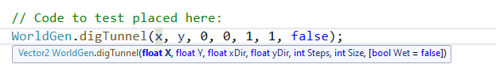    

Now that we have some code, we will do the steps above and test our code. Each time we see the results, we can edit the code after hitting the breakpoint once again to see the effect of our changes, thereby learning the meaning of the parameters. Once we know the meaning, we have the knowledge required to use the `WorldGen.DigTunnel` method in our actual world generation steps.

With `WorldGen.digTunnel(x, y, 0, 0, 1, 1, false);`, we get a small hole:
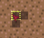    
Let's experiment with `Size`, here is the results of `WorldGen.digTunnel(x, y, 0, 0, 1, 10, false);`, we can see that `Size` seems to affect a radius:
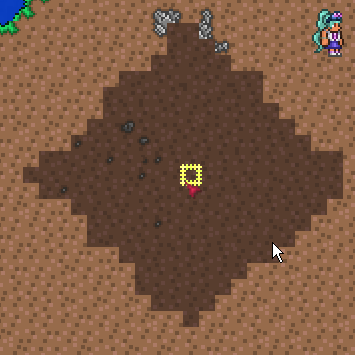    
Let's experiment with `Steps`, here is the results of `WorldGen.digTunnel(x, y, 0, 0, 10, 1, false);`. Its not clear the affect this parameter has, we probably need to test it in conjunction with other parameters:
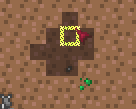    
Let's experiment with `Steps` and `xDir` and `yDir`. From reading vanilla code usages of `WorldGen.DigTunnel`, we can see that `xDir` and `yDir` are usually a number between -1 and 1, so lets try `WorldGen.digTunnel(x, y, 1, 1, 10, 1, false);`. Now we can see that `xDir` and `yDir` seem to affect the direction that the tiles are dug out, and that `Steps` seems to indicate how many times this digging process should iterate.
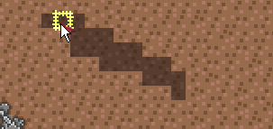
With the knowledge of the parameters we have gained from experimenting, let's try to make a long hole traveling down. My guess is a high `yDir`, hige `Steps`, and a medium `Size` will do what we want. Let's try `WorldGen.digTunnel(x, y, 0, 1, 30, 3, false);`:
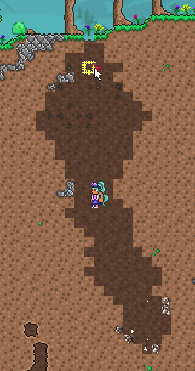
Looks good. I hope this experiment has shown how testing bits of code live in-game can help decipher the meaning of methods and parameters. You can also read the source code if you are feeling confident. 

## Advanced Code Setup
If you want to really quickly iterate on testing parameters, you can...

### SkipSelect

# Testing Complete Passes
If you are happy with the individual steps in a pass, you will need to test the complete pass by generating a new world and seeing if the results are satisfactory. At this stage, you should tweak things that control how many of your world generation structures generate. Using the WorldGen Previewer mod will help visualize the full picture of how prevalent your biomes and structures are in the world. Be mindful that players will be playing with other mods, so try not to cover the world with your structures. Rare world generation features that feel like a real discovery are exciting to players.

# Code Setup
Now that you have learned the prerequisites and have a productive setup, it is now time to learn the basic layout of world generation code. All code goes in a class extending `ModWorld`. This example will cover spawning ores, something simple but commonly desired. Please follow along and read the comments.

```csharp=
// 1. You'll need various using statments. Visual Studio will suggest these if they are missing, but they are listed here for convinience.
using System.Collections.Generic;
using Terraria;
using Terraria.GameContent.Generation;
using Terraria.ModLoader;
using Terraria.World.Generation;

// 2. Our world generation code must start from a class extending ModWorld
public class WorldGenTutorialWorld : ModWorld
{
	// 3. We use the ModifyWorldGenTasks method to tell the game the order that our world generation code should run
	public override void ModifyWorldGenTasks(List<GenPass> tasks, ref float totalWeight) {
		// 4. We use FindIndex to locate the index of the vanilla world generation task called "Shinies". This ensures our code runs at the correct step.
		int ShiniesIndex = tasks.FindIndex(genpass => genpass.Name.Equals("Shinies"));
		if (ShiniesIndex != -1) {
			// 5. We register our world generation pass by passing in a name and the method that will execute our world generation code.	
			tasks.Insert(ShiniesIndex + 1, new PassLegacy("World Gen Tutorial Ores", WorldGenTutorialOres));
		}
	}

	// 6. This is the actual world generation code.
	private void WorldGenTutorialOres(GenerationProgress progress) {
		// 7. Setting a progress message is always a good idea. This is the message the user sees during world generation and can be useful for identifying infinite loops.      
		progress.Message = "World Gen Tutorial Ores";

		// 8. Here we use a for loop to run the code inside the loop many times. This for loop scales to the product of Main.maxTilesX, Main.maxTilesY, and 2E-05. 2E-05 is scientific notation and equal to 0.00002. Sometimes scientific notation is easier to read when dealing with a lot of zeros.
		// 9. In a small world, this math results in 4200 * 1200 * 0.00002, which is about 100. This means that we'll run the code inside the for loop 100 times. This is the amount Crimtane or Demonite will spawn. Since we are scaling by both dimensions of the world size, the ammount spawned will adjust automatically to different world sizes for a consistent distribution of ores.
		for (int k = 0; k < (int)((Main.maxTilesX * Main.maxTilesY) * 6E-05); k++) {
			// 10. We randomly choose an x and y coordinate. The x coordinate is choosen from the far left to the far right coordinates. The y coordinate, however, is choosen from between WorldGen.worldSurfaceLow and the bottom of the map. We can use this technique to determine the depth that our ore should spawn at.
			int x = WorldGen.genRand.Next(0, Main.maxTilesX);
			int y = WorldGen.genRand.Next((int)WorldGen.worldSurfaceLow, Main.maxTilesY);

			// 11. Finally, we do the actual world generation code. In this example, we use the WorldGen.TileRunner method. This method spawns splotches of the Tile type we provide to the method. The behavior of TileRunner is detailed in the Useful Methods section below.
			WorldGen.TileRunner(x, y, WorldGen.genRand.Next(3, 6), WorldGen.genRand.Next(2, 6), TileID.CobaltBrick);
		}
	}
}
```
As you can see, `ModifyWorldGenTasks` is used to register each of your world generation passes. Each pass has a corresponding method that does some ammount of edits to the world. We insert our passes into the vanilla world generation pass order to make sure our code executes when appropriate.

## Adding Additional World Generation Code
To add more world generation code, first determine if you wish to add a step to an existing pass, or if you wish to make a new pass. Making a new pass is useful if the pass has no meaningful connection to the existing passes or if the order of existing modded or vanilla passes requires the new code to exist elsewhere.

For example, if we wished to spawn chests in the world, you can't do that in the same pass that you spawn ores, since ores spawn before tileimportant tiles are spawned. Ores spawning would corrupt chests placed too early. If you are making a biome, code digging out holes and code placing terrain can co-exist in the same pass.

If we wanted to spawn an additional ore, we could simply add another for loop to the `WorldGenTutorialOres` example above, and tweak the numbers to suit the new ore. This would be refered to as adding a step to the pass.

If we wanted to place chests, we would add code similar to the following to `ModifyWorldGenTasks`:
```cs
int BuriedChestsIndex = tasks.FindIndex(genpass => genpass.Name.Equals("Buried Chests"));
if (BuriedChestsIndex != -1) {
	tasks.Insert(BuriedChestsIndex + 1, new PassLegacy("World Gen Tutorial Chests", WorldGenTutorialChests));
}
```
And then add the `WorldGenTutorialChests` method as well. Make sure you don't mess up the c# syntax:
```
private void WorldGenTutorialChests(GenerationProgress progress) {
    // Chest placement code here
}
```

## Debugging considerations
If you are using the debugging setup described above, we'll need to further break down our code to facilitate testing. Here we can see that PlaceOresAtLocation can be called from both our hotkey code in `PostUpdate` and our world gen step called `WorldGenTutorialOres`, allowing the code to be independently tested.
```cs
public override void PostUpdate() {
    if (JustPressed(Microsoft.Xna.Framework.Input.Keys.D1))
        PlaceOresAtLocation((int)Main.MouseWorld.X / 16, (int)Main.MouseWorld.Y / 16);
}

private void WorldGenTutorialOres(GenerationProgress progress) {
    progress.Message = "World Gen Tutorial Ores";

    for (int k = 0; k < (int)((Main.maxTilesX * Main.maxTilesY) * 6E-05); k++) {
        int x = WorldGen.genRand.Next(0, Main.maxTilesX);
        int y = WorldGen.genRand.Next((int)WorldGen.worldSurfaceLow, Main.maxTilesY);

        PlaceOresAtLocation(x, y);
    }
}

// PlaceOresAtLocation is shared between our debug hotkey code and the WorldGenTutorialOres method. This allows us to test this portion of code quickly in-game, but also use the code in the world generation step.
private void PlaceOresAtLocation(int x, int y) {
    WorldGen.TileRunner(x, y, WorldGen.genRand.Next(3, 6), WorldGen.genRand.Next(2, 6), TileID.CobaltBrick);
}
```

# Determining a suitable index
Consult [Vanilla World Generation Passes](https://github.com/tModLoader/tModLoader/wiki/Vanilla-World-Generation-Steps) to find a suitable place to insert your world generation pass. Doing similar code immediately after similar world gen passes is usually a good rule to follow. Some early passes have no regard for multitiles, so avoid placing chests or other multitiles too early. The same concept applies to various terrain shaping methods, as doing such methods too late runs the risk of corrupting already placed multitiles, causing them to break or appear incomplete. 
Note: Don't group your `FindIndex` calls above your `task.Insert` code. If you do, the indexes could be wrong.
Here is an example of a potential issue that could be caused by running code at the wrong step. Here we see TileRunner code that has corrupted multitiles, such as doors, chests, and other decorative tiles: 
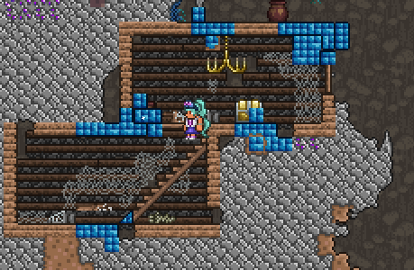    

## Vanilla World Generation Timeline
This section lists various important events that happen during world generation that will help you identify a suitable index for general world generation passes:

* Underworld: 
* Spawn Point: `Main.spawnTileX` and `Main.spawnTileY` are assigned
* TODO - Find important passes: last chance for large terrain edits, how to avoid corrupting chests, etc.

# Determining a starting location
Most world generation steps randomly pick a coordinate to start at. We can adjust the distribution of our world generation code by adjusting our choice for this initial coordinate.

## Random
We use the `WorldGen.genRand.Next` method to choose a random number. It is important that you use `WorldGen.genRand` for all random decisions, as it facilitates the world seed feature.

## Width
TODO: Center of map, safe zone around spawn, ocean position

## Depth
From to to bottom, here are the depths available during worldgen: 0, Worldgen.worldSurfaceLow, Worldgen.worldSurfaceHigh, Worldgen.rockLayerLow, Worldgen.rockLayerHigh, Main.maxTilesY. By adjusting the min and max provided to the `WorldGen.genRand.Next` method, we can tell the game the range of depths that we want our ore to spawn. The following is the copper ore spawning code from the game, it uses 3 separate for loops with differing parameters and loop multipliers to make ore deposits larger and more frequent the deeper you are:

```cs
for (int i = 0; i < (int)((double)(Main.maxTilesX * Main.maxTilesY) * 6E-05); i++) {
	TileRunner(WorldGen.genRand.Next(0, Main.maxTilesX), WorldGen.genRand.Next((int)WorldGen.worldSurfaceLow, (int)WorldGen.worldSurfaceHigh), WorldGen.genRand.Next(3, 6), WorldGen.genRand.Next(2, 6), copper);
}

for (int i = 0; i < (int)((double)(Main.maxTilesX * Main.maxTilesY) * 8E-05); i++) {
	TileRunner(WorldGen.genRand.Next(0, Main.maxTilesX), WorldGen.genRand.Next((int)WorldGen.worldSurfaceHigh, (int)WorldGen.rockLayerHigh), WorldGen.genRand.Next(3, 7), WorldGen.genRand.Next(3, 7), copper);
}

for (int i = 0; i < (int)((double)(Main.maxTilesX * Main.maxTilesY) * 0.0002); i++) {
	TileRunner(WorldGen.genRand.Next(0, Main.maxTilesX), WorldGen.genRand.Next((int)WorldGen.rockLayerLow, Main.maxTilesY), WorldGen.genRand.Next(4, 9), WorldGen.genRand.Next(4, 8), copper);
}
```
Note that the distance between `WorldGen.rockLayerLow` and `Main.maxTilesY` is a lot larger than the other 2 ranges, so the distribution of ores isn't as dense as the `* 0.0002` would suggest.

Also note that not all of these values persist into in-game. For example, Worldgen.worldSurfaceLow and Worldgen.worldSurfaceHigh are forgotten, and only Main.worldSurface remains. Main.worldSurface is equal to Worldgen.worldSurfaceHigh + 25.0. Make sure that if you are doing in-game world generation code that you are referenceing variables that are actually loaded, you can check `Terraria.IO.WorldFile.LoadHeader` to double check.

The underworld is located on the bottom 200 tiles of the map. `Main.maxTilesX - 200` and below will result in underworld coordinates.

## Biome
We can check the existing Tile at random coordinates to determine the biome at the choosen location. For example, if we wanted to place ores only near Snow, we could check for snow tiles:
```cs
Tile tile = Main.tile[x, y];
if (tile.active() && tile.type == TileID.SnowBlock) {
    // TileRunner code here
}
```
When checking conditions like this, it is important to think about whether you want your loop counter to increase on failure or stay the same. It is possible that all the random coordinates choosen might not contain snow, and the world would not be affected by your code. On the other hand, if you repeat your world generation code until snow is found a specific number of times, a world that has a small amount of snow could disproportionately be affected by your world generation code. Be aware of this possibility when designing your code.

### Spawn
`Main.spawnTileX` and `Main.spawnTileY` indicate the default spawn location. Typically `Main.spawnTileX` is somewhere within 5 tiles of `Main.maxTilesX / 2`, but mods can change this. The spawn location is assigned in the "Spawn Point" pass.

### Dungeon
`Main.dungeonX` and `Main.dungeonY` point to a tile on the entrance to the dungeon. TODO: `dungeonSide` instructions, info on when dungeonXY are set
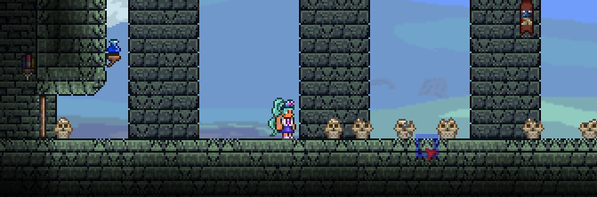

### Temple
The Temple location is not stored in the world file, but if you search all tiles for TileID.LihzahrdAltar or the locked door, you might be able to find it, but it is not guaranteed. 

TODO: On.makeTemple example

### Pyramid
Pyramid coordinates are also not remembered.

TODO: Use reflection to retrieve FieldInfo of local variabled captured via closure example. Retrieve PyrX and PyrY. (double check if editing closured vars can modify original captured variable values)

## Find Surface Location
To find a surface coordinate, you first choose a random X coordinate, then you start from the top of the world and check all tiles until you find the first solid tile. Here is an example:
```csharp=
int x = WorldGen.genRand.Next(0, Main.maxTilesX);
bool foundSurface = false;
int y = 1;
while (y < Main.worldSurface) {
	if (WorldGen.SolidTile(x, y)) {
		foundSurface = true;
		break;
	}
	y++;
}
```
In this example, we check against Main.worldSurface to make sure we don't go too deep. This is to ensure that you don't attempt to spawn a surface biome in the middle of a deep pit, for example. 

# Common Patterns
## Try Until Success
Finding a suitable location for many world generation operations can be difficult to do. For example, placing a chest requires 2 solid tiles side by side with a 2x2 space above without any tiles present. Writing an algorithm to search for a location with exactly that situation can be difficult and error prone. While there are times when searching for a specific context is useful, it is extremely common to do world generation code in a lazier manner. This lazier manner is attempting to do something at random coordinates until the desired amount of successes have been achieved. For example, if you want each world to spawn with 4 special chests in the world, you might attempt to place the chest randomly in the desired area until `PlaceChest` reports a success 4 times. When doing this approach, there exists the possibility that the searched area doesn't contain any positions that satisfy your conditions, so it is useful to limit attempts. If you don't limit attempts, your code could end up in an infinite loop. This attempt limit should be large enough that it doesn't fail too early, but small enough that world generation doesn't pause for too long, causeing the user to assume the code is stuck in an infinite loop.

As an example, lets attempt to place 10 chests in the world:
```cs
for (int i = 0; i < 10; i++) {
	bool success = false;
	int attempts = 0;
	while (!success) {
		attempts++;
		if (attempts > 1000) {
			break;
		}
		x = WorldGen.genRand.Next(0, Main.maxTilesX);
		y = WorldGen.genRand.Next(0, Main.maxTilesY);
		int chest = WorldGen.PlaceChest(x, y);
		success = chest != -1;
	}
	if(success)
		Main.NewText($"Placed chest at {x}, {y} after {attempts} attempts.");
	else
		Main.NewText($"Failed to place chest after {attempts} attempts.");
}
```
In this example, we attempt to place 10 chests, giving each chest 1000 attempts. Here is the output:
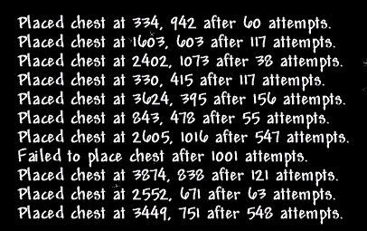    
Here you can see that with random coordinates, you can usually place a chest using `WorldGen.PlaceChest` within the 1000 attempts we allowed. Bumping 1000 up to 10000 would not be an issue, but would almost guarantee 10 chests rather than the 9 successes we see here. Computers are very fast, tens of thousands of placement attempts isn't a big deal. The most important thing is to allow your loops to fail after too many attempts, you do not want your world generation code stuck in an infinite loop.

## Affect All Tiles
Sometimes you want to do something to all tiles. For example, changing all Iron Ore tiles to MyCoolOre tiles. You can do this, but be mindful that applying a blanket change like this might conflict with the expectations of other mods. Also, it is probably best to do this in PostWorldGen or a late Pass to allow other code that looks for these tiles to do their work first. To do this, we use a double for loop:
```csharp=
for (int i = 0; i < Main.maxTilesX; i++) {
	for (int j = 0; j < Main.maxTilesY; j++) {
		Tile tile = Main.tile[i, j];
		if (tile.type == TileID.Iron)
			tile.type = ModContent.TileType<MyCoolOre>();
	}
}
```

## Placing Tile Entities
TODO: Have to manually place since they arne't placed the normal way

## Placing Items in Chests
After using `PlaceChest` to add a chest to a world, you can add items by accessing the `item` array of the `Chest` object at the location. If using `AddBuriedChest`, the `Chest` or chest index is not returned to the caller, so you can't modify the contents without searching the world for the Chest.

### Placing Items in New Chest
The following example shows many approaches to adding items. The important thing to remember is to properly track the current index of the Item slot you are editing. This example adds all the items at the end to simplify this. 
```csharp=
// Place the Chest tile, using style 10, which is the Icy Chest style
int chestIndex = WorldGen.PlaceChest(x, y, style: 10);
// If the chest successfully places...
if(chestIndex != -1) {
	Chest chest = Main.chest[chestIndex];
	// itemsToAdd will hold type and stack data for each item we want to add to the chest
	var itemsToAdd = new List<(int type, int stack)>();

	// Here is an example of using WeightedRandom to choose randomly with different weights for different items.
	int specialItem = new Terraria.Utilities.WeightedRandom<int>(
		Tuple.Create((int)ItemID.Acorn, 1.0),
		Tuple.Create((int)ItemID.Meowmere, 0.1),
		Tuple.Create(ModContent.ItemType<MyItem>(), 1.0),
		Tuple.Create((int)ItemID.None, 7.0) // Choose no item with a high weight of 7.
	);
	if(specialItem != ItemID.None) {
		itemsToAdd.Add((specialItem, 1));
	}
	// Using a switch statement and a random choice to add sets of items.
	switch (Main.rand.Next(4)) {
		case 0: 
			itemsToAdd.Add((ItemID.CobaltOre, Main.rand.Next(9, 15)));
			break;
		case 1:
			itemsToAdd.Add((ItemID.Duck, 1));
			break;
		case 2:
			itemsToAdd.Add((ItemID.FireblossomSeeds, Main.rand.Next(2, 5)));
			break;
		case 3:
			itemsToAdd.Add((ItemID.Glowstick, Main.rand.Next(9, 15)));
			itemsToAdd.Add((ItemID.Dynamite, Main.rand.Next(1, 3)));
			itemsToAdd.Add((ItemID.Bomb, Main.rand.Next(3, 7)));
			break;
	}

	// Finally, iterate through itemsToAdd and actually create the Item instances and add to the chest.item array
	int chestItemIndex = 0;
	foreach (var itemToAdd in itemsToAdd) {
		Item item = new Item();
		item.SetDefaults(itemToAdd.type);
		item.stack = itemToAdd.stack;
		chest.item[chestItemIndex] = item;
		chestItemIndex++;
		if (chestItemIndex >= 40)
			break; // Make sure not to exceed the capacity of the chest
	}
}
```

### Placing Items in Other Existing Chests
ExampleWorld.cs shows an example of placing a single item in a chest placed by other code. [Place some items in Ice Chests](https://github.com/tModLoader/tModLoader/blob/master/ExampleMod/ExampleWorld.cs#L380). You can also use techniques shown above if you want to place multiple items, you just need to make sure to follow the logic to find an empty item slot in Chest so you don't overwrite the existing items.

## Liquids
Liquids are stored in the Tile object coexisting with the actual tile, if it exists.

Many of the large-scale terrain methods have parameters that optionally place water in the resulting terrain. For example, `Worlgen.digTunnel` has a `wet` parameter that will fill the hole with some water after digging it. Look for similar parameters in other methods. To manually place a single tile of water, you can set the liquid type and liquid amount at that Tile by writing:
```csharp=
Main.tile[i,j].liquid = 255;
Main.tile[i,j].liquidType(Tile.Liquid_Water);
```

# In-Game/Multiplayer considerations
TODO:
* Many methods are not designed to be use in multiplayer. 
* Example on how to sync tile changes. Example of methods that don't send tile changes to avoid.
* Save corruption when leaving too early. (tModLoader needs WorldGen.IsGeneratingHardMode equivalent hook)
* Server crashing due to syncronous code. (needs example of async code, thread static warning)
* Always use Framing.GetTileSafely in-game
* Make sure code runs on server

# Stamp Tiles
Sometimes a mod wishes to place a well designed building or other designed feature into the world. Writing code to manually place each tile individually is quite cumbersome. There is a way to "stamp" a selection of tiles into the world. How it works is you first design the structure in-game, then you use the TODOMETHODNAME method to export a binary file that represents that selection of tiles. You can add that file to your mod and reference it in a worldgen pass. You can use the TODOMETHODNAME method to convert that file to a 2d array of Tiles. Once you have the tiles, you can find a suitable location and copy the tiles over to that location, like you were stamping the tiles over that location. When using this approach, you might want to spend some effort making sure the choosen location merges well with the tiles you are placing.

# Procedural Syntax
A more powerful approach to typical world generation code can be seen in many of the more recent world generation additions in vanilla code. This approach makes the more impressive world generation features of Terraria possible. The organic flow of the Living Mahogany Tree and the Enchanted Sword Shrine are good examples of the power of this approach. This procedural approach provides a means of chaining conditions and actions together in a more consise and less error prone way. The syntax is confusing if you are not familiar with advanced C# syntax patterns, but once you get the hang of it, this approach can be extremely powerful and efficient.

## Quick Example
As a quick primer on this approach, here is a quick example:
```csharp=
Point point = new Point(x, y);
WorldUtils.Gen(point, new Shapes.Circle(8, 8), new Actions.SetTile(TileID.RubyGemspark));
```
This code is intimidating, but it truly isn't too bad if you learn to read it. Basically the `WorldUtils.Gen` method takes a `Point`, `GenShape`, and `GenAction`. Starting at the coordinates signified by `Point`, the code of the `GenShape` traces out the desired shape while running the `GenAction` code on each of those coordinates. This code runs the `SetTile` method on each coordinate within a circle, creating a circle with radius of 8 filled with Gemspark tiles.
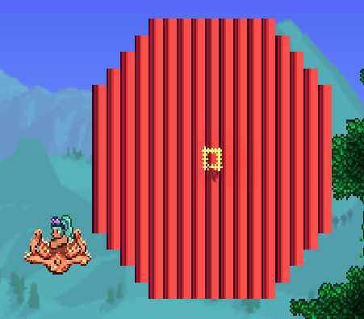    

```csharp=
Point point = new Point(x, y);
WorldUtils.Gen(point, new Shapes.Circle(8, 4), Actions.Chain(new GenAction[]
{
	new Actions.SetTile(TileID.AmberGemspark),
	new Actions.PlaceWall(WallID.BlueDynasty),
	new Actions.Custom((i, j, args) => {Dust.QuickDust(new Point(i, j), Color.Purple); return true; }),
}));
```
This example shows using `Actions.Chain` to chain together multiple `GenAction`s. We place AmberGemspark, place the Blue Dynasty wall, and spawn purple dust. The dust is just there to help visualize all the tiles that could be affected by the Shape provided. 
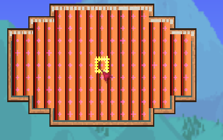

## GenShape
GenShapes are used to specify where the actions occur. Vanilla shapes such as `Circle` and `Rectangle` are self explanatory, others you may need to experiment with. A good example of using a GenShape is the `EnchantedSwordBiome` class. This class is responsible for the general shape of the world gen code.

### GenModShape
Classes inheriting from GenModShape use input `ShapeData` points to drive their coordinates. For example, `ModShapes.InnerOutline` can be used to affect the inner outline of the set of points provided by the `ShapeData`.

### Custom GenShape
Inheriting from GenShape allows custom shapes to be utilized.
```csharp=
// World Gen Code
Point point = new Point(x, y);
WorldUtils.Gen(point, new AngularSpiral(8), new Actions.SetTile(TileID.RubyGemspark));
WorldUtils.Gen(point, new AngularSpiral(8), new Actions.SetFrames());

// Custom GenShape class
public class AngularSpiral : GenShape
{
	private int radius;

	public AngularSpiral(int radius) {
		this.radius = radius;
	}

	public override bool Perform(Point origin, GenAction action) {
		int i = 0;
		int j = 0;
		int dx = 0;
		int dy = -1;
		while(i <= radius && j <= radius) { 
			if(-origin.X/2< i && i <= origin.X / 2 && -origin.Y / 2 < j && j <= origin.Y / 2)
				if (!UnitApply(action, origin, origin.X + i, origin.Y + j) && _quitOnFail)
					return false;
			if(i == j || (i<0 && i == -j) || (i>0 && i == 2 - j))
				(dx, dy) = (-dy, dx);
			(i, j) = (i + dx, j + dy);
		}
		return true;
	}
}
```

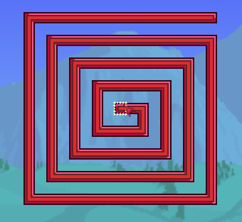

## GenAction
GenActions dictate the code that affects the coordinates provided by the GenShape. Some common actions include `SetTile`, to set the tile type, and `Scanner`, to tally the number of iterations of a GenShape.

### Scanner
`Scanner` can be used to count how many tiles currently satisfy the conditions of an `Actions.Chain`. This is useful for finding spots that are mostly some condition or another. For example, if you wanted to find a location that was 90% solid tiles, you could compare the result of the Scanner with the total number of tiles checked. This examples shows how to use Scanner via `Ref<int>`. This example also shows `Actions.ContinueWrapper`, which allows separating conditions into sub-chains that don't halt other chains when they fail. (Typically the chain will terminate when a an Action returns false.)

```csharp=
Ref<int> anyCount = new Ref<int>(0);
Ref<int> solidCount = new Ref<int>(0);
Ref<int> notsolidCount = new Ref<int>(0);
WorldUtils.Gen(point, new Shapes.Rectangle(10, 6), Actions.Chain(new GenAction[]
{
	new Actions.ContinueWrapper(Actions.Chain(new GenAction[]
	{
		new Modifiers.IsNotSolid(),
		new Actions.Custom((i, j, args) => {Dust.QuickDust(new Point(i, j), Color.Purple); return true; }),
		new Actions.Scanner(notsolidCount)
	})),
	new Actions.ContinueWrapper(Actions.Chain(new GenAction[]
	{
		new Modifiers.IsSolid(),
		new Actions.Custom((i, j, args) => {Dust.QuickDust(new Point(i, j), Color.YellowGreen); return true; }),
		new Actions.Scanner(solidCount)
	})),
	new Actions.Scanner(anyCount),
}));
Main.NewText($"Any {anyCount.Value}, Solid {solidCount.Value}, NotSolid {notsolidCount.Value}");
```
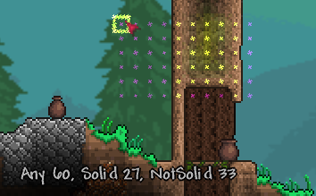

### TileScanner
`TileScanner` counts tiles by type in the given Shape. `TileScanner` helps calculate if a position is a suitable placement by checking nearby tiles. It helps avoid overlap with other world generation elements and helps place a world gen feature in a place that matches the exact desired location. The following example uses `TileScanner` to check that 50% of the tiles in the tested area are either Stone or Dirt. By adjusting our criteria, we can guarantee a pleasing placement of our world gen element.
```csharp=
Point point = new Point(x, y);
Dictionary<ushort, int> dictionary = new Dictionary<ushort, int>();
WorldUtils.Gen(point, new Shapes.Rectangle(20, 10), new Actions.TileScanner(TileID.Dirt, TileID.Stone).Output(dictionary));
int stoneAndDirtCount = dictionary[TileID.Dirt] + dictionary[TileID.Stone];
// 20 * 10 == 200. This is checking that at least 75% of the area is Stone or Dirt
if (stoneAndDirtCount < 150)
	Main.NewText($"Not a suitable location: {stoneAndDirtCount}/200");
else
	Main.NewText($"A Suitable location: {stoneAndDirtCount}/200");
Dust.QuickBox(new Vector2(x, y) * 16, new Vector2(x + 20, y + 10) * 16, 20, Color.Orange, null);
```
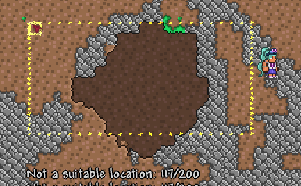

### Custom
The `Actions.Custom` `GenAction` allows arbitrary code to execute. Most of the typical things you'd like to do with GenActions are already covered by existing classes, but one example of using this is spawning dust:
```
new Actions.Custom((i, j, args) => { Dust.QuickDust(new Point(i, j), Color.Red); return true; }),
```

### Custom GenAction
Inheriting from `GenAction` can be used to run custom code on each coordinate. Here is an example called `ActionRope` modeled after `ActionVines`. Custom GenAction classes can help organize reusable portions of code.
```csharp=
public class ActionRope : GenAction
{
	private int _minLength;
	private int _maxLength;
	private int _vineId;

	public ActionRope(int minLength = 6, int maxLength = 10, int vineId = TileID.Rope) {
		_minLength = minLength;
		_maxLength = maxLength;
		_vineId = vineId;
	}

	public override bool Apply(Point origin, int x, int y, params object[] args) {
		int num = GenBase._random.Next(_minLength, _maxLength + 1);
		int i;
		for (i = 0; i < num && !GenBase._tiles[x, y + i].active(); i++) {
			GenBase._tiles[x, y + i].type = (ushort)_vineId;
			GenBase._tiles[x, y + i].active(active: true);
		}

		if (i > 0)
			return UnitApply(origin, x, y, args);

		return false;
	}
}

// Usage Code. This code calls ActionRope 1 block below wood tiles. NotTouching and Dither make the placement a bit more random
WorldUtils.Gen(point, new ModShapes.All(shapeData), Actions.Chain(
	new Modifiers.OnlyTiles(TileID.WoodBlock), 
	new Modifiers.Offset(0, 1), 
	new Modifiers.NotTouching(true, TileID.Rope),
	new Modifiers.Dither(0.5f),
	new ActionRope(5, 9)
));
```
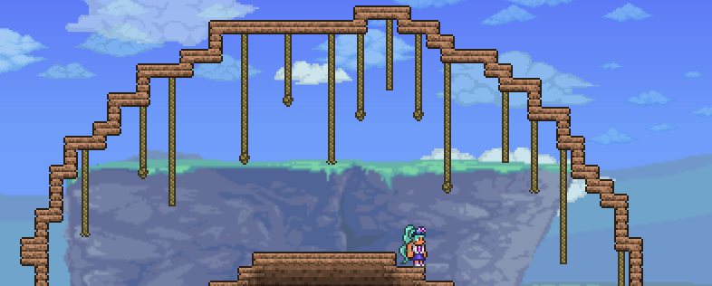

## Modifier
Modifiers are special GenActions that limit the execution of subseqently chained GenActions. A simple example of this is the `Dither` Modifier. `Dither` randomly terminates the chain of actions. In the example below, all tiles within the circle spawn the yellow dust, but the Dither modifier terminates the chain early 20% of the time, resulting in the tattered placement seen below.

```csharp=
WorldUtils.Gen(point, new Shapes.Circle(8, 4), Actions.Chain(new GenAction[]
{
	new Actions.Custom((i, j, args) => {Dust.QuickDust(new Point(i, j), Color.Yellow); return true; }),
	new Modifiers.Dither(.2),
	new Actions.SetTile(TileID.AmberGemspark),
}));
```
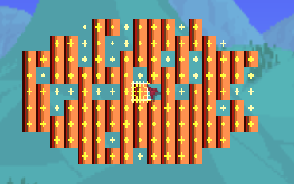

## Output
`Output` can be used to remember the set of coordinates at a specific GenAction. In this examples, we Output the result of 2 separate Circles into a shared `ShapeData`. This `ShapeData` is passed to `InnerOutline`, which computes which tiles from that data form an inner outline. In this manner, we basically union the results of both `GenShape`s and use those results to make a unique shape of Lava Moss tiles.
```csharp=
ShapeData shapeData = new ShapeData();
WorldUtils.Gen(point, new Shapes.Circle(5, 5), new Actions.Blank().Output(shapeData));
WorldUtils.Gen(point, new Shapes.Circle(3, 3), Actions.Chain(new GenAction[]
{
	new Modifiers.Offset(9, 0),
	new Actions.Blank().Output(shapeData)
}));
WorldUtils.Gen(point, new ModShapes.InnerOutline(shapeData, true), new Actions.SetTile(TileID.LavaMoss, true));
```
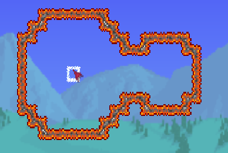

## GenCondition
`GenCondition`s are classes that determine if an area or coordinate satify a condition. By default, they only check the provided coordinate, but can be used to find areas that satisfy conditions. Areas are measured as a rectangle with the provided coordinate as the top left corner. GenConditions are typically used in conjunction with `WorldUtils.Find` to find a suitable location for a step.

### AreaAnd
By modifying a `GenCondition` with `AreaAnd`, all coordinates within the area must satisfy the condition to be considered a success. For example, `new Conditions.IsSolid().AreaAnd(6, 2)` checks that all tiles in a 6 tile wide by 2 tile high area are all solid.

### AreaOr
`AreaOr` checks if any tile in the area satisfies the condition. For example, `new Conditions.IsSolid().AreaOr(3, 1)` attemps to determine if any tile in a 3x1 area is solid.

### Not
`Not` can be applied to `AreaAnd`, `AreaOr`, or a `GenCondition` without an area. `Not` applied without an area will invert the condition. For example, `new Conditions.IsSolid().Not()` will be a success only if the tile is NOT solid. `Not` applied to `AreaOr` acts as a NOR operation, as in none of the tiles in the area satisfy the condition. `new Conditions.IsSolid().Not().AreaOr(3, 5)` would attempt to find a 3x5 area without any Solid tiles in it. `Not` applied to `AreaAnd` acts as a NAND operation, returning true only if not all tiles satisfy the condition, or in other words, at least 1 tile doesn't satisfy the condition.

### Offset
Offsetting GenConditions is not yet supported. What this means is that all GenConditions in a single Find will share the top left corner.

## Find
`WorldUtils.Find` can be used to search for a location that meets certain conditions. Through the use of `Searches` and a number of `GenCondition`s, the method attempts to find a coordinate that satisfies all the conditions. The `Searches.Down` directs the Find to start at the input `Point` and travel down at most 20 tiles in search of a suitable location. The method returns true if the search was successful. The conditions in this example attempt to find a 5x5 square of tiles that are all solid and Sand. If this is found, obsidian is placed in the middle. The yellow dust shows the area that was discovered that matched the conditions. The cursor shows that the search started above ground and searched down until it found the final result.
```csharp=
Point resultPoint;
bool searchSuccessful = WorldUtils.Find(point, Searches.Chain(new Searches.Down(20), new GenCondition[]
{
	new Conditions.IsSolid().AreaAnd(5, 5),
	new Conditions.IsTile(TileID.Sand).AreaAnd(5, 5),
}), out resultPoint);
if (searchSuccessful) {
	Main.tile[resultPoint.X + 2, resultPoint.Y + 2].type = TileID.Obsidian;
}
```
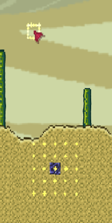

## Case Studies
Here are some complex examples that can show the full potential of this approach to world generation code.
### Enchanted Sword Shrine
The code for Enchanted Sword Shrine is found in the `Terraria.GameContent.Biomes.EnchantedSwordBiome` class. This section will examine how `EnchantedSwordBiome` uses various techniques to cleanly generate the shrine at a suitable location without issue. Follow along with the comments and the video below.

```csharp=
public override bool Place(Point origin, StructureMap structures) {
// By using TileScanner, check that the 50x50 area centered around the origin is mostly Dirt or Stone
Dictionary<ushort, int> tileDictionary = new Dictionary<ushort, int>();
WorldUtils.Gen(new Point(origin.X - 25, origin.Y - 25), new Shapes.Rectangle(50, 50), new Actions.TileScanner(TileID.Dirt, TileID.Stone).Output(tileDictionary));
if (tileDictionary[TileID.Dirt] + tileDictionary[TileID.Stone] < 1250)
	return false; // If not, return false, which will cause the calling method to attempt a different origin

Point surfacePoint;
// Search up to 1000 tiles above for an area 50 tiles tall and 1 tile wide without a single solid tile. Basically find the surface.
bool flag = WorldUtils.Find(origin, Searches.Chain(new Searches.Up(1000), new Conditions.IsSolid().AreaOr(1, 50).Not()), out surfacePoint);
// Search from the orgin up to the surface and make sure no sand is between origin and surface
if (WorldUtils.Find(origin, Searches.Chain(new Searches.Up(origin.Y - surfacePoint.Y), new Conditions.IsTile(TileID.Sand)), out Point _))
	return false;

if (!flag)
	return false;

surfacePoint.Y += 50; // Adjust result to point to surface, not 50 tiles above
ShapeData slimeShapeData = new ShapeData();
ShapeData moundShapeData = new ShapeData();
Point point = new Point(origin.X, origin.Y + 20);
Point point2 = new Point(origin.X, origin.Y + 30);
float xScale = 0.8f + GenBase._random.NextFloat() * 0.5f; // Randomize the width of the shrine area
// Check that the StructureMap doesn't have any existing conflicts for the intended area we wish to place the shrine.
if (!structures.CanPlace(new Rectangle(point.X - (int)(20f * xScale), point.Y - 20, (int)(40f * xScale), 40)))
	return false;
// Check that the StructureMap doesn't have any existing conflicts for the shaft leading to the surface
if (!structures.CanPlace(new Rectangle(origin.X, surfacePoint.Y + 10, 1, origin.Y - surfacePoint.Y - 9), 2))
	return false;
// Using the Slime shape, clear out tiles. Blotches gives the edges a more organic look. https://i.imgur.com/WtZaBbn.png
WorldUtils.Gen(point, new Shapes.Slime(20, xScale, 1f), Actions.Chain(new Modifiers.Blotches(2, 0.4), new Actions.ClearTile(frameNeighbors: true).Output(slimeShapeData)));
// Place a dirt mound within the cut out slime shape
WorldUtils.Gen(point2, new Shapes.Mound(14, 14), Actions.Chain(new Modifiers.Blotches(2, 1, 0.8), new Actions.SetTile(TileID.Dirt), new Actions.SetFrames(frameNeighbors: true).Output(moundShapeData)));
// Remove the mound coordinates from the slime coordinate data
slimeShapeData.Subtract(moundShapeData, point, point2);
// Place grass along the inner outline of the slime coordinate data
WorldUtils.Gen(point, new ModShapes.InnerOutline(slimeShapeData), Actions.Chain(new Actions.SetTile(TileID.Grass), new Actions.SetFrames(frameNeighbors: true)));
// Place water in empty coordinates in the bottom half of the slime shape
WorldUtils.Gen(point, new ModShapes.All(slimeShapeData), Actions.Chain(new Modifiers.RectangleMask(-40, 40, 0, 40), new Modifiers.IsEmpty(), new Actions.SetLiquid()));
// Place Flower wall on all slime shape coordinates. Place vines 1 tile below all grass tiles of the slime shape.
WorldUtils.Gen(point, new ModShapes.All(slimeShapeData), Actions.Chain(new Actions.PlaceWall(WallID.Flower), new Modifiers.OnlyTiles(TileID.Grass), new Modifiers.Offset(0, 1), new ActionVines(3, 5)));
// Remove tiles to create shaft to surface. Convert Sand tiles along shaft to hardened sand tiles.
ShapeData shaftShapeData = new ShapeData();
WorldUtils.Gen(new Point(origin.X, surfacePoint.Y + 10), new Shapes.Rectangle(1, origin.Y - surfacePoint.Y - 9), Actions.Chain(new Modifiers.Blotches(2, 0.2), new Actions.ClearTile().Output(shaftShapeData), new Modifiers.Expand(1), new Modifiers.OnlyTiles(TileID.Sand), new Actions.SetTile(TileID.HardenedSand).Output(shaftShapeData)));
WorldUtils.Gen(new Point(origin.X, surfacePoint.Y + 10), new ModShapes.All(shaftShapeData), new Actions.SetFrames(frameNeighbors: true));
// 33% chance to place an enchanted sword shrine tile
if (GenBase._random.Next(3) == 0)
	WorldGen.PlaceTile(point2.X, point2.Y - 15, TileID.LargePiles2, mute: true, forced: false, -1, 17);
else
	WorldGen.PlaceTile(point2.X, point2.Y - 15, TileID.LargePiles, mute: true, forced: false, -1, 15);
// Place plants above grass tiles in the mound shape.
WorldUtils.Gen(point2, new ModShapes.All(moundShapeData), Actions.Chain(new Modifiers.Offset(0, -1), new Modifiers.OnlyTiles(TileID.Grass), new Modifiers.Offset(0, -1), new ActionGrass()));
// Add to the StructureMap to prevent other worldgen from intersecting this area.
structures.AddStructure(new Rectangle(point.X - (int)(20f * xScale), point.Y - 20, (int)(40f * xScale), 40), 4);
return true;
}
```
Click to view [HQ Video](https://gfycat.com/ForcefulImmediateAsiaticlesserfreshwaterclam) of Enchanted Sword Shrine

# Useful Methods

## [Terraria.WorldGen] public static void TileRunner(int i, int j, double strength, int steps, int type, bool addTile = false, float speedX = 0f, float speedY = 0f, bool noYChange = false, bool overRide = true)
This method places small splotches of the specified tile (`type`) starting at the coordinates (`x` and `y` in tile coordinates). This method is typically used for placing ores or other non-frameimportant tiles, like sand, dirt, or stones. Special values of type have special effects. `-1` will remove tiles rather than place tiles, and `-2` will do the same but add lava if the coordinates are below the lava line. The shape and size are controlled by the `strength` and `steps` parameters. `strength` guides how big the splotch of tiles is, and `steps` indicates how many times the process will repeat. For example, a small `strength` and small `steps` would result in a small splotch, a large `strength` and a small `steps` would result in a large splotch, and a small `strength` and a large `steps` would result in a long but skinny path of tiles. `speedX` and `speedY` drive the initial direction that the path of individual steps will take, but the method will randomly adjust the direction as well. `noYChange` when true seems to place dirt wall behind tiles at surface level, and also has some effect on the variance of the vertical movement. `addTile` when true places additional tiles in the world. `overRide` when true changes existing tiles to the specified tile. 
TileRunner is NOT SAFE to use when multitiles are in the world with the `overRide` parameter as `true`, as it will corrupt them. It is also not safe to use in multiplayer, as it does not "frame" the tiles nor does it sync the tile changes. The latest vanilla step that uses this method is the "Gems" step, so the latest position to place a step using this method with `overRide` parameter as `true` would be immediately after the "Gems" step. If you have a tile that shouldn't be overridden by ores and gems spawning, set `TileID.Sets.CanBeClearedDuringGeneration[Type]` to false for that ModTile. As multitiles shouldn't be in the world when TileRunner is called, you should only need to set this for terrain tiles that you don't want ores bleeding into.    

     
[HQ Version](https://gfycat.com/wigglyjauntyhydatidtapeworm)  


## [Terraria.WorldGen] public static void OreRunner(int i, int j, double strength, int steps, ushort type)
Similar to `TileRunner`, but without many of the options. OreRunner places small splotches of the specified tile (`type`) starting at the coordinates (`x` and `y` in tile coordinates). OreRunner only replaces active tiles that are either `TileID.Sets.CanBeClearedDuringOreRunner` or `Main.tileMoss`, making it suitable to be used even after frameimportant tiles exist in the world. If you have a tile that should be suseptible to being replaced when additional ores are spawned in the world, set `TileID.Sets.CanBeClearedDuringOreRunner` to `true` for that ModTile. Vanilla code only uses this method when spawning hardmode ores. This method is suitable for use in-game and in multiplayer as it both frames and syncs tile changes.

## [Terraria.WorldGen] public static int PlaceChest(int x, int y, ushort type = 21, bool notNearOtherChests = false, int style = 0)
The method attempts to place a chest at the given coordinates. The coordinate provided will be the bottom left corner of the resulting chest, if the method succeeds. `type` is the tile type to place, and `style` is the style type to place. For vanilla chests, you can count from zero starting from the left in the Tiles_21.png image after [extracting the vanilla textures](https://github.com/tModLoader/tModLoader/wiki/Intermediate-Prerequisites#vanilla-texture-file-reference) to find the style you want to place. `notNearOtherChests` can be set to true to prevent the chest from placing if another chest exists within 25 tiles left or right and 8 tiles up and down. This method returns the chest index of the chest that was successfully placed or -1 if placing the chest failed. Chest placement can fail for many reasons, such as if existing tiles block the space, or if there isn't 2 suitable solid tiles directly below the intended location. See [Try Until Success](Try Until Success) for an approach to using this method. See [Placing Items in Chests](Placing Items in Chests) for info on placing items in the chest.
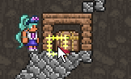

## [Terraria.WorldGen] public static bool AddBuriedChest(int i, int j, int contain = 0, bool notNearOtherChests = false, int Style = -1)
The method attempts to place a chest and fill it typical loot according to the style and depth. Without any parameters, a regular, gold, or locked shadow chest will be created, depending on the depth. You can pass in an item type for `contain` and the first item in the chest will be that item. Unlike `PlaceChest`, the resulting chest will be placed with the bottom right corner at the given coordinates. In addition, if the given `j` coordinate isn't suitable, AddBuriedChest will search down from the given coordinate to find the first solid tile it encounters and attempt to place there. This method returns true if a chest was successfully placed, but be aware that the chest might not be exactly at the coordinates you provide. Here is an example of running the method with the default parameters `WorldGen.AddBuriedChest(x, y);`. Notice how the chest style changes according to depth and how the chest is placed on the floor directly below the provided coordinates if possible:

[HQ Version](https://gfycat.com/wigglyjauntyhydatidtapeworm)  
See [Placing Items in Chests](Placing Items in Chests) for info on placing items in the chest.

## [Terraria.WorldGen] public static bool InWorld(int x, int y, int fluff = 0)
When dealing with random coordinates combined with addition or subtraction, there is a chance you might construct coordinates outside the bounds of the world. This will crash world generation, so it is important that you check that the coordinates are suitable before attempting to do things at those coordinates. Use this method to check if the given coordinates fall inside the world. The `fluff` parameter further checks that the coordinates are at least that many tiles away from the edge, which is useful for world generation actions that could affect large areas of tiles.

## [Terraria.WorldGen] public static Point RandomWorldPoint(int top = 0, int right = 0, int bottom = 0, int left = 0)
A more streamlined approach to finding a random tile coordinate in the world. `Point point = WorldGen.RandomWorldPoint((int)Main.worldSurface, 50, 500, 50)` is eqivalent to 
```cs
int x = WorldGen.genRand.Next(50, Main.maxTilesX - 50);
int y = WorldGen.genRand.Next((int)Main.worldSurface, Main.maxTilesY - 500);
```

## [Terraria.WorldGen] public static void KillTile(int i, int j, bool fail = false, bool effectOnly = false, bool noItem = false)
`KillTile` can be used to destory the tile or multitile at the specified `i` and `j` coordinates. `fail` prevents the tile from being destroyed, but still plays a hit sound. `effectOnly` prevents the tile from being destroyed but still spawns hit dust and prevents the hit sound. `noItem` prevents the item from dropping.

## [Terraria.WorldGen] public static bool PlaceTile(int i, int j, int type, bool mute = false, bool forced = false, int plr = -1, int style = 0)
PlaceTile is the main way to place individual tiles while obeying anchor considerations. `i` and `j` are the coordinates. These coordinates relate to the origin of the tile, not neccessarily the top left corner of the tile. Read [Basic Tile](https://github.com/tModLoader/tModLoader/wiki/Basic-Tile) to familiarize yourself with the concepts of Anchors and Origins. `mute` indicates if a sound should be made, this only applies to in-game usage as sounds are all muted during world gen. `forced` attempts to place the tile even if other tiles are already at the coordinates, but it is unreliable. `plr` does nothing except affect bathtubs. `style` refers to the style of the tile type provided. Styles are explained in the Basic Tile guide. 

PlaceTile returns a bool indicating placement success. Unfortunately, it doesn't work, don't use it. Checking the coordinates after calling PlaceTile is a good way to check if the placement was a success: `if(Main.tile[x, y].type == TileID.Campfire)`

PlaceTile doesn't expose everything. For example, attempting to place a tile with a specific style will be ignored by many of the underlying methods. Another issue is that it is impossible to place a tile that has left and right placement orientations facing right. In these situations, you might need to manually place each tile in the multitile or use `WorldGen.PlaceObject` instead. `WorldGen.PlaceObject` requires more input. For example, placing Coral with `PlaceObject` means you have to manually specify the style, as the random style choosing is a feature of PlaceTile. 

TODO: Explain how to place a TileEntity in code, since PlaceTile won't automatically do it.

## MicroBiome


## StructureMap
During world generation, the game uses StructureMap, accessed through `Worldgen.structures`, to track important world generation features to prevent overlap. The StructureMap is basically a collection of Rectangles indicating areas in the world that are occupied by world generation features that should not be interfered with. If you are spawning something important, you might want to add to StructureMap via the `Worldgen.structures.AddProtectedStructure` method to tell other world generation passes to avoid the area. StructureMap is cooperative, if you are placing structures, it would be a good idea to check with the `Worldgen.structures.CanPlace` structure prior to placing a structure at a coordinate. Some structures vanilla places in StructureMap include Hives, Enchanted Sword Altars, and Cabins. StructureMap doesn't have to be used for all structures, as biomes interacting with each other is interesting. Use StructureMap for structures that shouldn't interact and check StructureMap before doing destructive operations in late passes.

This image shows entries in StructureMap highlighted in green.
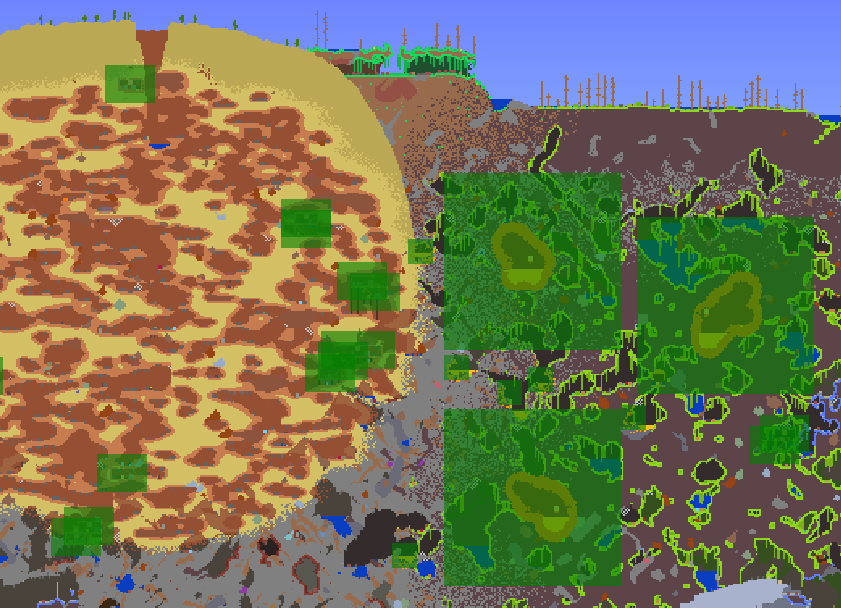

## TileID.Sets.GeneralPlacementTiles
When code is checking `Worldgen.structures.CanPlace`, CanPlace will additionally search the area for tiles that are false in `GeneralPlacementTiles`. Setting a TileID to false in GeneralPlacementTiles will prevent structures that obey the StructureMap from attempting to place over it. 

## TileID.Sets.CanBeClearedDuringGeneration
This code affect terrain methods like Cavinator and TileRunner. Tiles marked false in this array will survive those operations. 

# IL Editing
Vanilla world generation passes are all anonymous methods, which unfortunately mean that IL editing is much harder. We have to manually use HookEndpointManager, and further complicating matters is the method names are autogenerated.
TODO: Do they change often? How to find them programatically, example.


# scribblings
				//int a = 0;
				//for (int i = 0; i < Main.maxTilesX; i++) {
				//	for (int j = 0; j < Main.maxTilesY; j++) {
				//		Tile tile = Main.tile[i, j];
				//		if (tile.active() && Main.tileFrameImportant[tile.type]) {
				//			a++;
				//		}
				//	}
				//}
				//Logging.tML.Info($"After step {pass2.Name}: {a}");


/tweak WorldGenTutorialWorld intA
/tweak Main dayTime
/tweak Main drawingPlayerChat
/tweak Main musicBox


World Gen Tutorial World: Small, Normal, Random, UseExperimentalFeatures, 

Mention WorldGenPreviewere